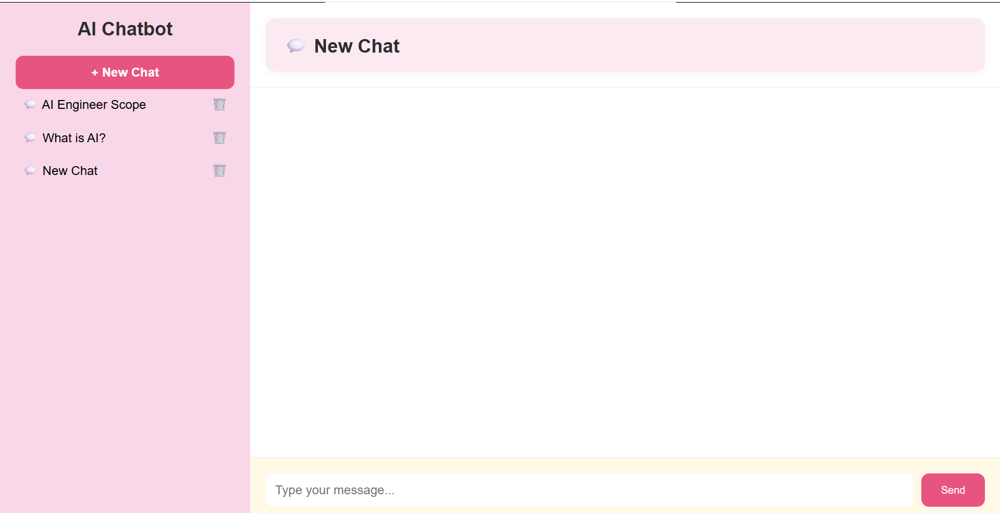
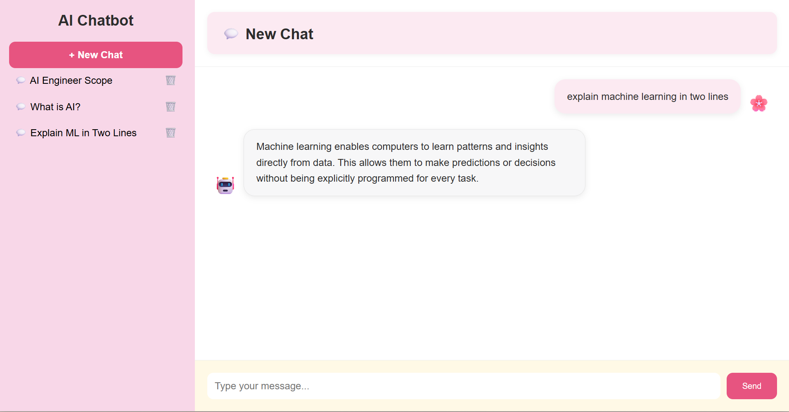
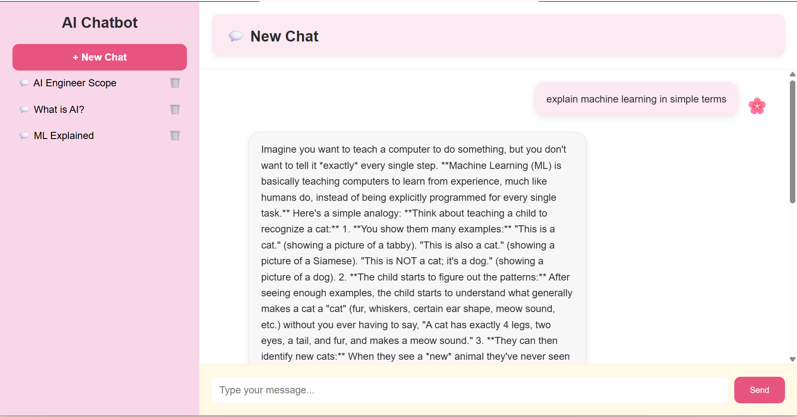
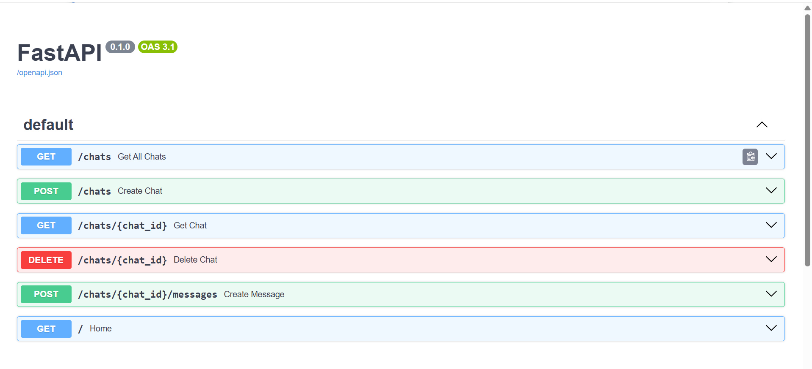
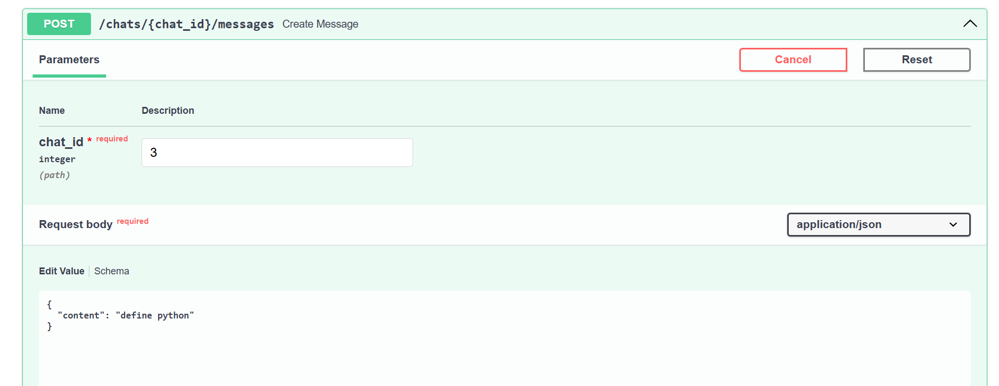
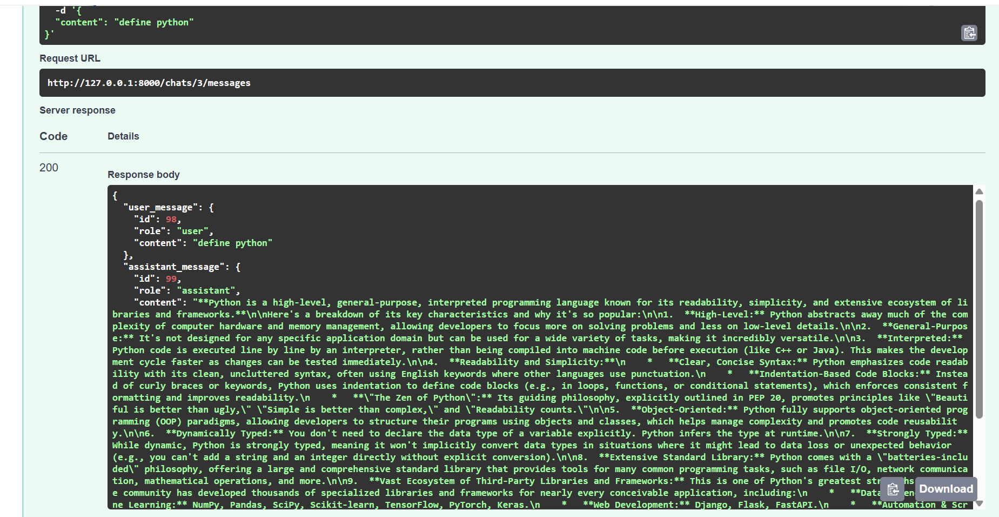
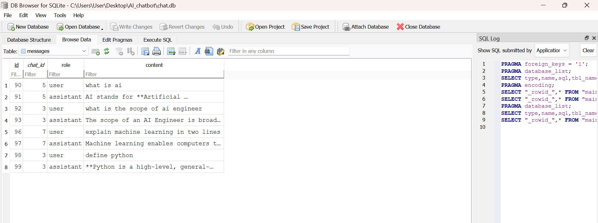

# fullstack-ai-chatbot
# 🤖 Full Stack AI Chatbot

A full-stack AI chatbot built with **FastAPI**, **JavaScript**, **HTML/CSS**, **SQLAlchemy**, and the **Google Gemini API**. The chatbot supports multiple conversations, automatically generates chat titles, stores chat history in a database, and provides a clean, responsive user interface.

---

## ✨ Features

* 💬 Create multiple chat conversations
* 🧠 AI responses powered by Google Gemini
* 📝 Automatic chat title generation
* 📚 Persistent chat history using SQLite
* 🗂️ Sidebar displaying previous conversations
* 🗑️ Delete chat conversations
* ⚡ FastAPI REST API backend
* 🎨 Clean frontend built with HTML, CSS, and JavaScript

---

## 🛠️ Tech Stack

### Backend

* Python
* FastAPI
* SQLAlchemy
* SQLite
* Google Gemini API
* Uvicorn

### Frontend

* HTML
* CSS
* JavaScript

---

## 📁 Project Structure

```text
full_stack_ai_chatbot/
│
├── backend/
│   ├── main.py
│   ├── models.py
│   ├── schemas.py
│   ├── database.py
│   ├── crud.py
│   ├── ai_service.py
│   ├── requirements.txt
│   ├── .env.example
│   └── ...
│
├── front_end/
│   ├── index.html
│   ├── style.css
│   └── script.js
│
└── assets-screenshots/
```

## 📸 Project Screenshots
## 📸 Project Screenshots

### User Interface


### Sidebar Chat History


### AI Conversation Demo


### Swagger API Overview


### Chat Endpoint


### FastAPI Response


### Database Preview

## 🚀 Getting Started

### 1. Clone the repository

```bash
git clone https://github.com/zainabnoorriaz/fullstack-ai-chatbot.git
cd fullstack-ai-chatbot
```

### 2. Create a virtual environment

```bash
python -m venv .venv
```

Activate it:

**Windows**

```bash
.\.venv\Scripts\activate
```

### 3. Install dependencies

```bash
pip install -r backend/requirements.txt
```

### 4. Configure your API key

Inside the `backend` folder, create a file named `.env`.

Add your own Gemini API key:

```env
GEMINI_API_KEY=your_api_key_here
```

### 5. Start the backend

```bash
cd backend
uvicorn main:app --reload
```

### 6. Open the frontend

Open `front_end/index.html` in your browser.

---


## 🎯 Future Improvements

* User authentication
* Streaming AI responses
* Markdown rendering
* File upload support
* Dark/Light theme toggle
* Cloud deployment

---

## 📚 What I Learned

This project helped me gain hands-on experience with:

* Building REST APIs using FastAPI
* Connecting a frontend with a backend
* Working with SQLAlchemy and SQLite
* Integrating the Google Gemini API
* Managing multiple chat conversations
* Using Git and GitHub for version control
* Protecting API keys using environment variables

---

## 👩‍💻 Author

**Zainab Noor Riaz**

Computer Science Student | Aspiring AI Engineer

GitHub: https://github.com/zainabnoorriaz


